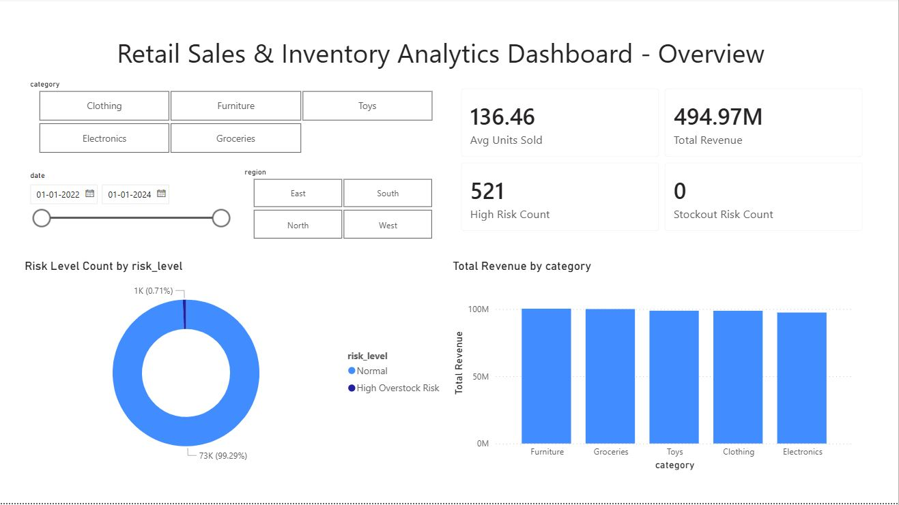
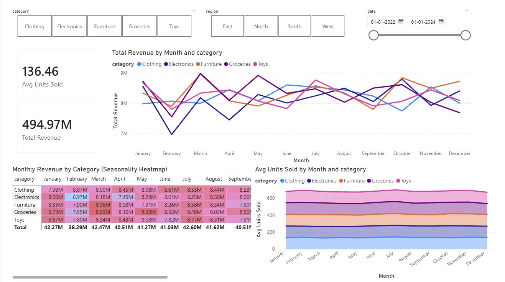
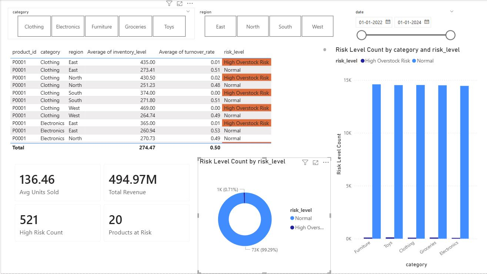

# Retail Sales & Inventory Analytics Dashboard

> *Dashboard Preview — click through the images above*

End-to-end retail analytics solution built as the **capstone project** for the Google Data Analytics Certificate.

It covers the full pipeline:

- Data cleaning & feature engineering in **Python**
- Structured storage in **MySQL**
- Interactive multi-page dashboard in **Power BI**

The dashboard helps analyze **sales performance**, **seasonality**, **inventory levels**, and **stock risk** across product categories, regions, and time periods.

## 🎯 Objectives

Transform raw retail data into actionable business insights by simulating a realistic analytics workflow:

- Clean and prepare messy real-world data
- Engineer meaningful analytical features
- Store data in a relational database
- Build professional, interactive BI dashboards
- Support operational and strategic decision-making

## 🛠️ Tools & Technologies

| Stage              | Technology      | Purpose                                           |
|--------------------|-----------------|---------------------------------------------------|
| Data Processing    | Python          | Cleaning, transformation, feature engineering     |
| Libraries          | Pandas, NumPy   | Data manipulation & calculations                  |
| Database           | MySQL           | Structured storage & production-like querying     |
| Visualization      | Power BI        | KPIs • Trends • Heatmaps • Slicers • Interactivity|

## 📊 Dashboard Pages

### 1. Overview
- Executive summary view
- Slicers: Category • Region • Date range
- Key KPIs:  
  - Total Revenue  
  - Avg Units Sold  
  - High-Risk Inventory Count  
  - Stockout Risk Indicators
- Revenue by category • Risk level distribution

### 2. Sales & Seasonality Analysis
- Monthly revenue trend by category
- Seasonal heatmap (Month × Category)
- Average units sold over time
→ Great for spotting **peak seasons** and **category-specific patterns**

### 3. Inventory & Risk Analysis
- Detailed product-level table (SKU, category, region, stock, turnover, risk)
- Risk distribution across categories
- Operational summary KPIs
→ Helps identify **overstock**, **slow movers**, and **potential stockouts**

## 🔍 Key Insights You Can Get

- Which categories drive most revenue?
- When are seasonal peaks and dips?
- Which products/regions have inventory imbalances?
- Which items are at high risk of overstock or stockout?
- Better supply planning, promo timing, and inventory optimization

## Skills Showcased

- Data cleaning & quality assurance
- Feature engineering (revenue, turnover, risk flags, time periods…)
- Relational database design & data loading
- KPI & metric development
- Interactive dashboard design & storytelling
- End-to-end analytics pipeline

## 📁 Repository Structure
retail-analytics-dashboard/
├── data/
│   ├── raw/                   # original downloaded file
│   └── cleaned/               # processed version
├── python/                    # cleaning & feature engineering
│   └── preprocessing.ipynb
├── database/
│   ├── schema.sql
│   └── load_data.sql
├── dashboard/
│   └── Retail_Analytics_Dashboard.pbix
├── screenshots/               # dashboard images for README
│   ├── overview.png
│   ├── sales-seasonality.png
│   └── inventory-risk.png
└── README.md

## Dataset

**Retail Store Inventory Forecasting Dataset**  
Downloaded from **Kaggle**  
Contains realistic sales, inventory, category, region, and date information.

## Acknowledgments

Built as part of the **Google Data Analytics Certificate** capstone.  
Inspired by modern retail analytics and business intelligence best practices.

---

**Stack:** Python · MySQL · Power BI

